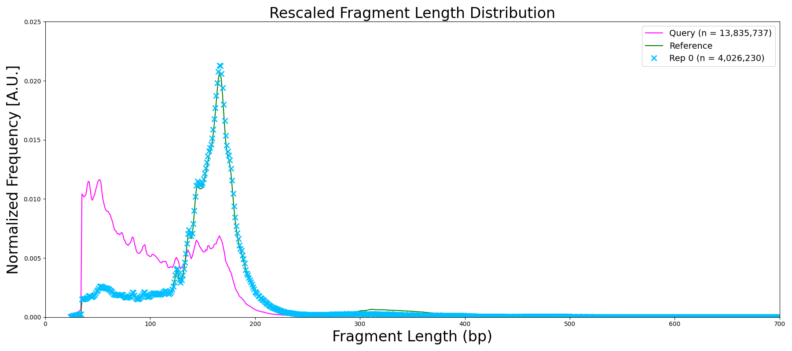
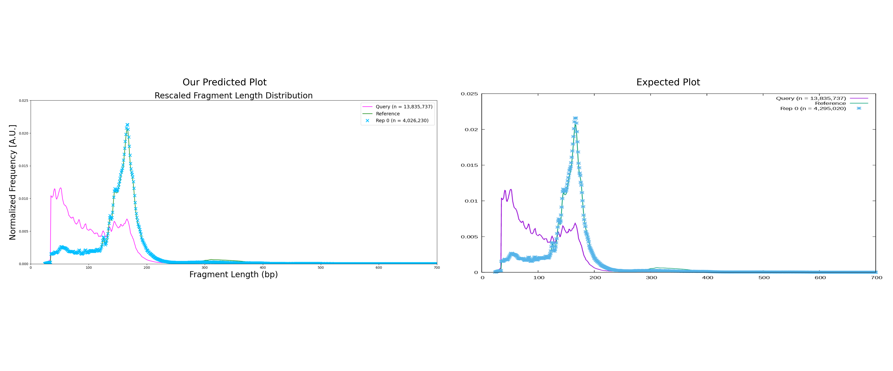

---

# Fragment Length Frequency & Rescaling Analysis

## Overview

In this notebook, we tackle two main tasks:

1. **Fragment Length Frequency Calculation**  
   We start by working with a compressed BED file (`query.bed.gz`). Each line in this file represents a DNA fragment, and we need to calculate the length of each fragment by subtracting the start position from the end position. Once we have the fragment lengths, we count how often each length appears and normalize these counts to get a frequency distribution.

2. **Rescaling the Distribution**  
   The challenge here is to rescale the query data's distribution to match a given reference distribution (`reference.hist`). Essentially, we adjust the query data (through subsampling) so that its distribution aligns with the reference distribution. We then compare the original, rescaled, and reference distributions in plots.

## Methodology

### Step 1: Parsing the Data and Calculating Fragment Lengths

We start by reading the `query.bed.gz` file using Python’s `gzip` module. For each fragment, we extract the start and end positions (columns 2 and 3), and calculate the fragment length by subtracting the start position from the end position. These lengths are collected into a list.

### Step 2: Frequency Counting and Normalization

Once we have the fragment lengths, we use Python’s `Counter` to count how often each length occurs. To normalize these frequencies, we divide each count by the total number of fragments. This gives us the normalized frequency, which allows for comparison between different lengths on the same scale.

### Step 3: Plotting the Distributions

We then plot the normalized frequency distribution of the fragment lengths using `matplotlib`. The query distribution is plotted in magenta, and we also load the reference distribution from `reference.hist` (using `pandas`), and plot it alongside for comparison. 

### Step 4: Rescaling (Subsampling) the Query Data

Next, we focus on rescaling the query data to match the reference distribution. Here's how it works:
- We first categorize the fragments by length.
- We then calculate the target number of fragments (about 30% of the original total, for example).
- Based on the reference distribution, we subsample the query data to match the reference frequency distribution, drawing samples proportionally for each fragment length.

Once the rescaling is done, we compute and plot the normalized frequency of the rescaled data, and compare it to both the original query data and the reference.

### Step 5: Side-by-Side Comparison

For evaluation, we place the predicted rescaled plot next to the expected output for easy visual comparison. The two images are resized to the same dimensions and displayed side by side. This gives us a clear picture of how well the rescaling process worked.

## Output Images

### 1. **Predicted Distribution Plot**
Here’s the final output showing how the query’s fragment length distribution (in magenta) compares to the reference distribution (in green), with the rescaled distribution shown as discrete markers in deepsky blue.

### 2. **Side-by-Side Comparison**
To make the comparison easier, we present the predicted plot next to the expected output. This allows us to visually verify if the rescaled query distribution matches the reference distribution.

## Conclusion

In this notebook, we've walked through:
- **Fragment length frequency calculation**: Extracting and normalizing fragment lengths from the query data.
- **Rescaling the distribution**: Adjusting the query data to match a reference distribution through subsampling.
- **Visualization and comparison**: Creating and comparing plots for the original, rescaled, and reference distributions.

Hence, this approach provides a clear and effective way to perform such analysis on genomic data, ensuring the distributions align with a reference for further study or validation.

---
