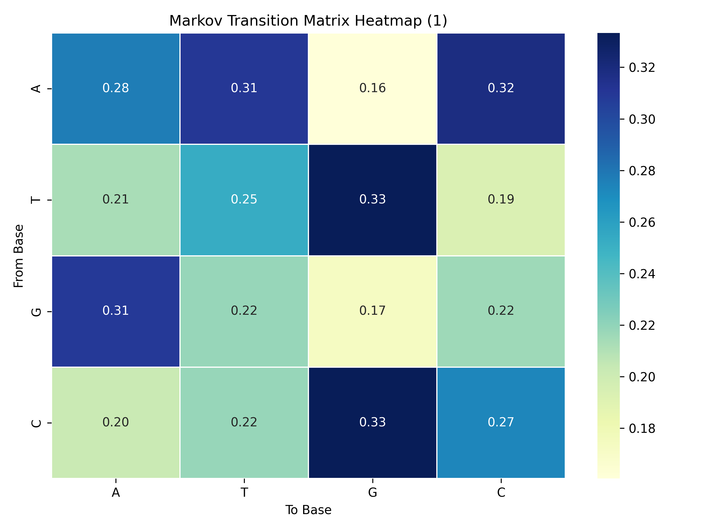

---

# 1st-Order Markov Transition Matrix from DNA Sequences 🧬

---

## Overview

This project constructs a **1st-order Markov transition matrix** from DNA sequences, capturing the probability that one nucleotide (A, T, G, or C) follows another. The resulting matrix provides a powerful statistical snapshot of sequence dynamics and can reveal characteristic transition patterns useful in genomics research and bioinformatics applications.

---

## What’s the Goal?

- **Quantify nucleotide transitions:** How likely is ‘A’ to be followed by ‘T’, or ‘G’ to follow ‘C’?  
- **Represent these probabilities in a matrix** where each row corresponds to the current base and each column to the next base.  
- **Visualize the results with heatmaps** for quick interpretation of dominant and rare transitions.

---

## Methodology

1. **Reading sequences:** We parse multi-sequence FASTA files efficiently, extracting sequences with their headers.  
2. **Counting transitions:** For every adjacent base pair in each sequence, we tally transitions using a dynamic dictionary.  
3. **Normalizing counts:** Transition counts per base are converted to probabilities so that each row sums to 1.  
4. **Visualizing:** Heatmaps highlight transition strengths, making patterns visually intuitive.  
5. **Saving outputs:** CSV matrices and PNG heatmaps are saved for further analysis and reporting.

---

## Why Use `defaultdict`? A Comparative Perspective

Choosing the right data structure directly impacts the efficiency, readability, and scalability of the code. Here’s how `defaultdict` compares with other common options:

| Data Structure               | Pros                                                         | Cons                                                        |
|------------------------------|--------------------------------------------------------------|-------------------------------------------------------------|
| **Fixed-size 2D Arrays**     | Fast indexing; minimal runtime overhead                       | Wastes memory on zero entries; manual mapping required      |
| **Nested `dict` of `dict`**  | Flexible; intuitive key-based access                          | Verbose code; manual key existence checks required          |
| **`defaultdict(int)` nested**| Automatic zero initialization; clean, concise; memory efficient | Minor dictionary lookup overhead                             |
| **Pandas DataFrame**          | Excellent for visualization; easy data manipulation          | Inefficient for incremental counting; memory overhead       |
| **Sparse Matrices**           | Efficient for very large sparse data                          | Complex updates; overkill for small alphabets               |

`defaultdict` strikes the perfect balance, making the implementation:

- **Robust:** No risk of `KeyError` on new keys.  
- **Elegant:** Minimal boilerplate code.  
- **Efficient:** Memory and computation only for observed transitions.  
- **Scalable:** Handles entire chromosomes without redesign.


In this project, `defaultdict` provides the perfect balance between **performance, readability, and memory usage**, making the code both elegant and scalable.

---

## Core Function: Building the Markov Matrix

```python
from collections import defaultdict
import pandas as pd

def build_markov_transition_matrix(sequence):
    valid_bases = "ATGC"
    counts = {base: defaultdict(int) for base in valid_bases}
    
    for i in range(len(sequence) - 1):
        a, b = sequence[i], sequence[i+1]
        if a in valid_bases and b in valid_bases:
            counts[a][b] += 1
    
    data = {}
    for base in valid_bases:
        total = sum(counts[base].values())
        data[base] = [round(counts[base][next_base] / total, 4) if total else 0 for next_base in valid_bases]
    
    df = pd.DataFrame(data, index=list(valid_bases))
    df.index.name = "From\\To"
    return df
```

---

## Visualizing with Heatmaps

Heatmaps translate the matrix into an intuitive visual:  
- **Blue cells:** High transition probability — strong preference.  
- ** cells:** Low or no observed transitions.  

Example heatmap:



This visualization helps identify **dominant transitions** quickly, a key step in understanding sequence characteristics.

---

## How To Use This Project

1. Place your multi-sequence FASTA file in the `data/` folder.  
2. Run the script to generate transition matrices and heatmaps for each sequence.  
3. Find all outputs neatly organized in the `outputs/` directory — CSV files for raw probabilities and PNGs for heatmaps.  
4. Explore and compare nucleotide transition patterns across sequences or species.

---

## Why This Matters

- **Biological Insights:** Transition probabilities often reflect biological mechanisms and constraints, such as mutation biases or sequence motifs.  
- **Data Compression:** Understanding transition structure can help in compressing DNA data or improving sequence models.  
- **Foundation for Advanced Analysis:** This matrix serves as a building block for more sophisticated Markov models, motif detection, or sequence simulation.

---

## Summary

This project demonstrates how a simple yet powerful tool like a **`defaultdict`** combined with data normalization and visualization can unlock meaningful patterns in DNA sequences. By efficiently building and displaying Markov transition matrices, we gain a window into the language of life encoded in nucleotide sequences.

---

