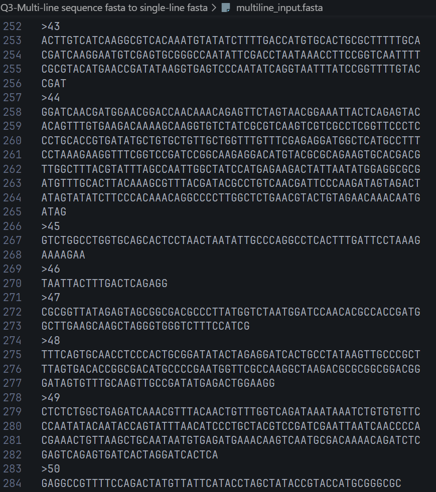
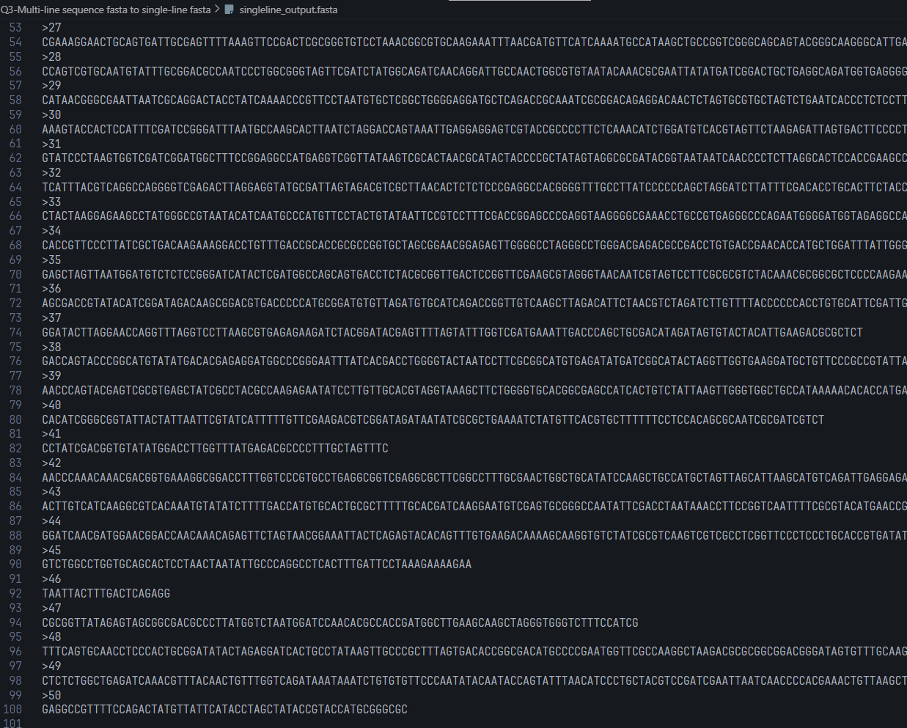

---

# 🚀 Converting Multi-line FASTA to Single-line FASTA (Memory-Efficient)

FASTA files are the standard for storing DNA, RNA, or protein sequences. Typically, sequences are split into fixed-width lines — often 60 characters per line — for readability.

However, this formatting can be frustrating when **searching for sequences that span line breaks**. Imagine trying to find a substring that crosses two lines and failing because the sequence is split!

---

## 🎯 The Task

**Goal:** Convert a multi-line FASTA file into a *single-line* FASTA file where each header is followed by its full sequence on one continuous line.

Why?

- Fixed-width lines break searches for substrings crossing line boundaries.
- Handling very large sequences (like human chromosomes with hundreds of millions of bases) efficiently is crucial.
- Using memory-heavy methods (like lists or string concatenation) can crash or slow down your program.

---


## 🧠 Why This Matters

If your query sequence spans a fixed-width boundary, it won’t be found in the multi-line format. This can lead to missed matches in bioinformatics analyses, affecting downstream results like motif searches or primer design.

---

## 🔧 Methodology: Memory-Efficient Conversion

Our solution reads and writes sequences *line-by-line*, avoiding in-memory concatenation or list storage — essential when working with massive genome files.

**Key features:**

- Headers (`>...`) are preserved.
- Sequence lines are merged into one continuous line directly in the output.
- Minimal memory footprint, scalable to gigabase sequences.
- Handles empty lines gracefully.
- Ensures the output ends cleanly with a newline.

---

## 💻 Core Python Code Snippet

```python
def multiline_to_singleline_fasta(input_path, output_path):
    with open(input_path, 'r') as infile, open(output_path, 'w') as outfile:
        header = None
        for line in infile:
            line = line.rstrip()
            if not line:
                continue
            if line.startswith('>'):
                if header is not None:
                    outfile.write('\n')  # End previous sequence
                header = line
                outfile.write(header + '\n')
            else:
                outfile.write(line)
        outfile.write('\n')  # Final newline
```

---

## ⚠️ Why We Avoid Lists and Other Memory-Heavy Data Structures

When processing large FASTA files — especially those containing massive genomes — **how you store and manipulate sequences in memory matters a lot**. Here are common pitfalls with popular approaches:

### Common Approaches and Their Downsides:

- **Using Lists to Accumulate Sequence Lines**

  ```python
  seq_lines = []
  for line in infile:
      if not line.startswith('>'):
          seq_lines.append(line.strip())
  full_sequence = ''.join(seq_lines)
  ```
  
  - *Pitfall:* Appending every line to a list grows memory usage linearly with sequence length.
  - For huge chromosomes (hundreds of millions of bases), this can exhaust RAM and crash programs.
  - Joining lists at the end creates an additional copy, doubling memory usage temporarily.

- **String Concatenation in a Loop**

  ```python
  sequence = ''
  for line in infile:
      if not line.startswith('>'):
          sequence += line.strip()
  ```
  
  - *Pitfall:* Strings are immutable in Python, so each concatenation creates a new string.
  - This results in **quadratic time complexity** and poor performance on large files.

- **Using Other Data Structures (e.g., NumPy arrays, Pandas)**

  - *Pitfall:* Though powerful, these libraries add overhead and are not optimized for simple streaming text processing.
  - Loading entire sequences into arrays wastes memory if the goal is just line concatenation.
  - Increases dependencies and complexity unnecessarily.

---

## 💪 Strengths of Our Memory-Efficient Streaming Approach

- **Streaming line-by-line processing:**

  - Reads the input FASTA file one line at a time, never holding the entire sequence in memory.
  - Writes output immediately, so memory usage stays constant regardless of file size.

- **No list or buffer accumulation:**

  - Avoids building large intermediate data structures.
  - Prevents memory spikes, enabling processing of multi-gigabase sequences on modest hardware.

- **Minimal string operations:**

  - Writes each sequence line directly, concatenating on disk rather than in RAM.
  - The output file itself becomes the single-line sequence repository.

- **Handles empty lines and preserves headers robustly:**

  - Skips blank lines cleanly.
  - Writes headers as-is, ensuring FASTA compliance.

- **Simple, dependency-free:**

  - Pure Python solution with no extra libraries.
  - Easy to read, maintain, and integrate into pipelines.

---

This approach strikes a perfect balance between **efficiency, simplicity, and scalability**, making it ideal for real-world bioinformatics workflows working on large genomes or high-throughput data.


---

## 📸 Visuals: Input & Output Screenshots

Here are snapshots of the files involved, and the result of the work.

| Multi-line Input FASTA | Single-line Output FASTA |
|:----------------------:|:------------------------:|
|  |  |

*The original multi-line sequence (left) vs the clean, searchable single-line sequence (right).*

---

## 🔍 Demonstration: Searching Across Line Boundaries

We selected a sequence substring that **spans the 60-character boundary** in the multi-line input:

```
Breakpoint substring: [CGCAGCCACG]
```

- Searching this in **multi-line FASTA** → ❌ *Not found*
- Searching in **single-line FASTA** → ✅ *Found*

This proves converting to a single-line format **restores searchability** for boundary-spanning sequences.

---

## 📊 Results & Stats

- Total sequences processed: **50**
- Total bases merged: **12,398**

Our approach ensures sequences are contiguous and ready for downstream processing without sacrificing performance or memory.

---

## 🎯 Final Takeaway

Converting multi-line FASTA files into single-line sequences is not just about aesthetics — it is **crucial for accurate sequence analysis**. Our memory-efficient method scales to massive datasets, maintaining speed and low memory consumption.

---

