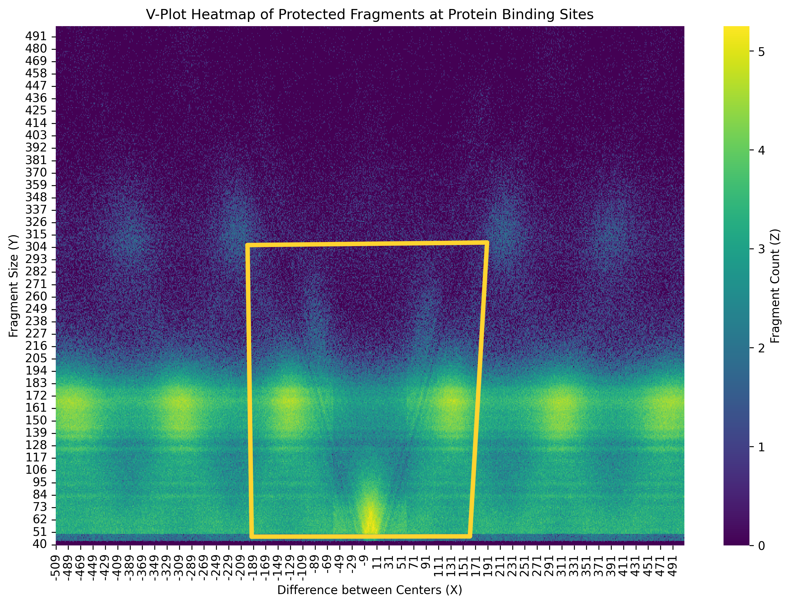

---

# V-Plot Heatmap of Protected DNA Fragments

This project visualizes **protein-DNA interactions** through a **V-plot heatmap**. When a protein binds to DNA, that region becomes protected from nucleases. By analyzing these protected fragments, we can uncover structural signatures — typically forming a **"V" shape** around the binding site.

---

## Objective

Given a dataset of mapped DNA fragments around protein binding sites, the goal is to:

- Compute:
  - `X`: Difference between centers of fragments and binding sites.
  - `Y`: Fragment size.
  - `Z`: Number of occurrences (frequency) of a specific fragment size at a given center offset.
- Generate a heatmap showing this `(X, Y, Z)` information.
- Reveal the characteristic **V-formation** of protected regions near binding sites.

---

## Input Data Format

The input is a gzipped, tab-separated file (`mapped.bed.gz`) where each line includes information about a protected DNA fragment and its associated binding site.

### Example Line:

```
2	chr1	90919	91937	chr1:91382-91550|...	16.2951	+	chr1	90838	91006	...
```

### Key Columns:

- **Fragment Start/End**: Columns 3 & 4
- **Binding Site Start/End**: Columns 9 & 10

---

## How it Works

1. **Parse each line** and extract:
   - `C1 = (fragment_start + fragment_end) // 2`
   - `C2 = (binding_start + binding_end) // 2`
   - `X = C2 - C1` (Center offset)
   - `Y = binding_end - binding_start` (Fragment size)
2. **Aggregate Z**: Count how often each `(X, Y)` pair occurs.
3. **Visualize**: Plot a heatmap of `Z` values with `X` and `Y` axes.

---

## Output

- A **high-resolution heatmap** (`v_plot_heatmap.png`) that illustrates the V-shaped protection pattern.
- X-axis: Offset between centers of fragment and binding site
- Y-axis: Fragment size
- Color: Frequency of occurrence (`Z`)
- Yellow Box: Puts the 'V' inside the box, for a more focused view.

<p align="center">
  
</p>

---

## Getting Started

### 1. Install dependencies

```bash
pip install pandas matplotlib seaborn
```

### 2. Run the notebook

Open `v_plot_heatmap.ipynb` and run all cells to generate the visualization.


---

## Interpretation

The **"V" shape** in the heatmap suggests that fragments closer to the center of protein-DNA interaction sites are shorter and more frequent. This aligns with the biological expectation of **protection footprints** from nucleases.
<p align="center">
  
</p>

---

## Sample Insight

An entry like:

```
X = -500, Y = 65, Z = 10
```

means that **500 bases upstream** of a protein binding site, there are **10 fragments** of length **65 bp**, highlighting protection at that site.

---

## Files

- `mapped.bed.gz`: Input dataset of mapped fragments.
- `q5_V_Plot.ipynb`: Jupyter notebook for analysis.
- `v_plot_heatmap.png`: Final heatmap image.
- `v_plot_heatmap_annotated.png`: The same heatmap, slightly annotated to clearly show the 'V' in the plot
- `README.md`: The file that you are currently reading!

---

