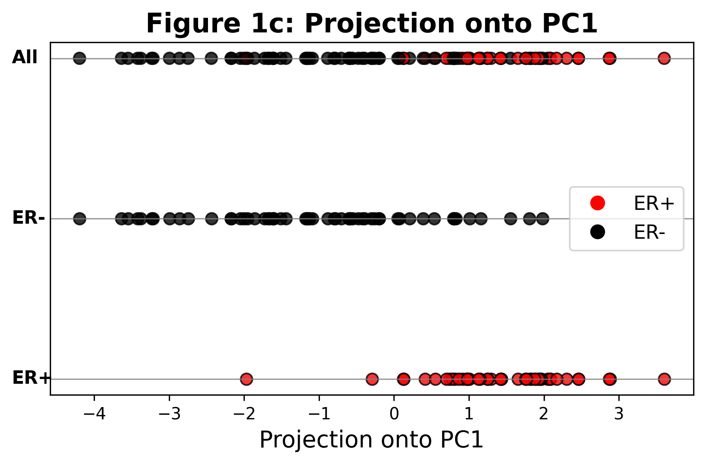

---

# 🧬 Principal Component Analysis (PCA) on Breast Cancer Gene Expression Data

This project implements **Principal Component Analysis (PCA)** from scratch on breast cancer gene expression data, inspired by a figure from a *Nature* Primer article. The objective is to replicate Figure 1, which highlights expression patterns and variance captured by PCA—particularly in the context of **estrogen receptor (ER)** status.

---

## 📝 Task Breakdown

Here's what the project tackles:

1. 📊 Extract expression levels for two key genes: **XBP1** and **GATA3**.
2. 🎯 Plot XBP1 vs GATA3 expression (Figure 1a), color-coded by ER status.
3. 🧠 Run PCA on the full gene expression matrix to compute principal components.
4. 🪞 Project the data onto the first principal component (PC1) to visualize class separation (Figure 1c).

---

## 📂 Data Files

The analysis uses the following datasets (located in `data/`):

| File | Description |
|------|-------------|
| `class.tsv` | Binary labels for ER status: `1` = ER⁺, `0` = ER⁻ |
| `filtered.tsv.gz` | Gene expression matrix (genes × patients) |
| `columns.tsv.gz` | Mapping of gene IDs to gene names (e.g., 4404 → XBP1) |

---

## 📈 Results

### 🔹 Figure 1a: XBP1 vs GATA3 Expression

A scatter plot of **XBP1** (Y-axis) vs **GATA3** (X-axis) for 105 patients.  
Color code:  
- 🔴 **Red** = ER-positive (ER⁺)  
- ⚫ **Black** = ER-negative (ER⁻)


> The clustering aligns well with the separation described in the reference paper.

---

### 🔹 Figure 1b: PCA Arrows on Expression Space

PCA projection vectors (PC1 & PC2) overlaid on the XBP1–GATA3 space.


> 📐 The directions of variance are consistent with the theoretical PCA vectors.

---

### 🔹 Figure 1c: Projection onto PC1

Samples projected onto the first principal component (PC1), colored by ER status.



> Clear linear separation is visible between ER⁺ and ER⁻ patients, validating PCA’s effectiveness in capturing biologically relevant variation.

---

## 🧾 Summary

- **Key Insights**:
  - Expression patterns of XBP1 and GATA3 are predictive of ER status.
  - PCA reduces high-dimensional data while preserving meaningful structure.
  - Projection onto PC1 highlights class separation aligned with ER classification.

- **Why PCA?**
  - It’s an unsupervised method to identify directions of maximal variance.
  - PCA helps in dimensionality reduction, making patterns more interpretable and visually accessible.

---

## 🛠️ How to Run

1. Place all data files (`class.tsv`, `filtered.tsv.gz`, `columns.tsv.gz`) into a folder named `data/`.
2. Install required Python packages (if not already installed):

   ```bash
   pip install pandas numpy matplotlib
   ```

3. Run the notebook in your favorite environment (e.g., Jupyter, Colab, VSCode).

---

## 📌 Credits

- Inspired by Figure 1 in the [Nature Primer](https://www.nature.com/articles/nbt0308-303).
- Data courtesy of the associated breast cancer dataset (details in the notebook).
- PCA implemented from scratch for transparency and educational value.

---

