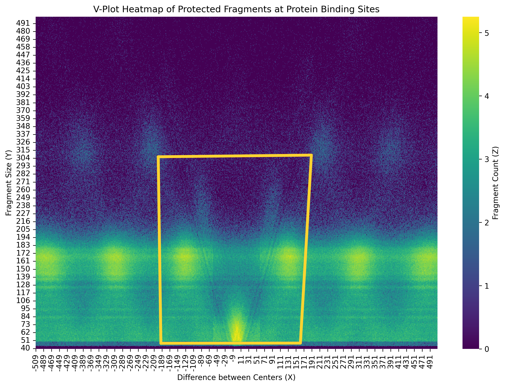

# BEE-102-2025-Assignment

# CSE Assignment – Genomics Programming

This repository presents solutions to the six computational biology tasks assigned to CSE students as part of the Genomics Programming module. The solutions involve core operations in biological data processing using Python, with an emphasis on accuracy, performance, and reproducibility. All plots and visual outputs are included, with annotated figures and documented methodology.

---

## Task 1: Fragment Length Frequency and Rescaling *(3 Marks)*

**Files**: `query.bed.gz`, `reference.hist`

### Objective
- Calculate normalized fragment length frequency.
- Rescale the query distribution to match a reference.

### Highlights
- Used `gzip` for memory-efficient BED file reading.
- Fragment lengths computed as: `length = end - start`.
- Frequencies normalized using Python's `Counter`.
- Subsampling based on reference histogram.

### Outputs
- **Original vs Rescaled Distributions**:
  <p align="center">
    
  </p>

- **Side-by-Side Comparison**:
  <p align="center">
    
  </p>

---

## Task 2: Markov Transition Matrix *(1 Mark)*

### Objective
Construct a first-order Markov transition matrix to quantify nucleotide transition probabilities.

### Implementation
- Parsed sequences from FASTA using streaming I/O.
- `defaultdict` used for compact and efficient transition counting.
- Normalized row-wise probabilities.
- Heatmaps generated using `seaborn`.

### Output Sample
<p align="center">
  
</p>

---

## Task 3: Multi-line to Single-line FASTA Conversion *(1 Mark)*

**File**: `multiline_input.fasta`

### Objective
Convert wrapped sequences in FASTA format into single-line representations.

### Method
- Streamed input/output line-by-line to minimize memory.
- Headers preserved; sequence lines written in-place.
- Avoided lists, string joins, and buffer accumulations.

### Input vs Output
| Multi-line Input | Single-line Output |
|------------------|---------------------|
|  |  |

---

## Task 4: Viterbi Algorithm for Nature Primer *(3 Marks)*

### Objective
- Define an HMM with states: Exon (E), Splice Site (5), Intron (I).
- Compute log-probability for a known path.
- Infer most probable path using the Viterbi algorithm.

### Key Features
- Log-space probability calculations for numerical stability.
- Dynamic programming matrix with backtracking.
- Emission and transition matrices defined as per primer.

### Sample Output
```
Most probable path: EEEEEEEE5IIIIIII
Log probability: -38.6776
```

---

## Task 5: V-Plot Visualization *(1 Mark)*

**File**: `mapped.bed.gz`

### Objective
Visualize protection footprints of DNA-binding proteins using fragment center offset (X) vs fragment size (Y).

### Method
- Parsed binding site and fragment centers from data.
- Aggregated (X, Y) frequency counts (Z).
- Generated a 2D heatmap to display fragment density.

### Output
<p align="center">
  
</p>

---

## Task 6: PCA on Gene Expression Data *(2 Marks)*

**Files**:
- `data/class.tsv`  
- `data/filtered.tsv.gz`  
- `data/columns.tsv.gz`

### Objective
Reproduce PCA figures from the Nature Primer on breast cancer gene expression data.

### Steps
1. Extract XBP1 and GATA3 expression levels.
2. Generate 2D scatter plot (Figure 1a).
3. Compute PCA and project onto PC1 (Figure 1c).

### Visual Outputs
- **Scatter Plot: XBP1 vs GATA3**:
  <p align="center">
    
  </p>

- **PCA Vector Projection**:
  <p align="center">
    
  </p>

- **Projection on PC1**:
  <p align="center">
    
  </p>

---

## Dependencies
```bash
pip install numpy pandas matplotlib seaborn gzip
```

---

## Notes
- All scripts are compatible with Python 3.6+.
- Outputs are organized in respective folders under `output_files/`, `data/`, and `figures/`.
- Each notebook is self-contained with code, explanation, and result plots.

---

## Acknowledgements
- Assignments are based on the Genomics Programming course.
- PCA and HMM tasks follow examples from the Nature Primer.
- Data and annotations are used as provided for educational purposes.

---
All tasks use Python 3 with standard packages (`numpy`, `pandas`, `matplotlib`, `seaborn`, etc.) and are tested on datasets provided in the assignment. Each script includes comments and is designed for readability and reproducibility.

